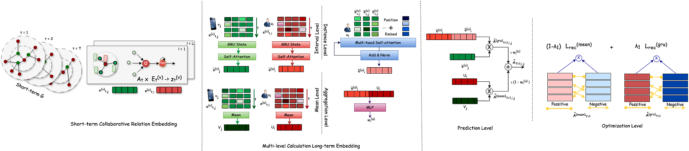

# Adaptive Long-term Embedding with Denoising and Augmentation for Recommendation
<p align="center">

</p>

## Dataset
We used four publicly available datasets—Gowalla, MovieLens, Yelp, and Amazon—for evaluation. In line with the standard implicit feedback approach, an element is assigned a value of 1 if a user has rated an item; otherwise, it is set to 0. Users and items with very few interactions were removed from the dataset.

For dataset splitting, we designate the most recent interaction as the test set, the second-to-last interaction as the validation set, and the rest of the user behavior sequence as the training data.

The datasets are located in the `./Datasets` folder.

```
- ./Datasets/yelp(amazon/movielens/gowalla)
|--- sequence    # user behavior sequences (List)
|--- test_dict    # test item for each users (Dict)
|--- trn_mat_time    # user-item graphs in different periods (sparse matrix)
|--- tst_int    # users to be test (List)
```

[//]: # (## Model Training)
